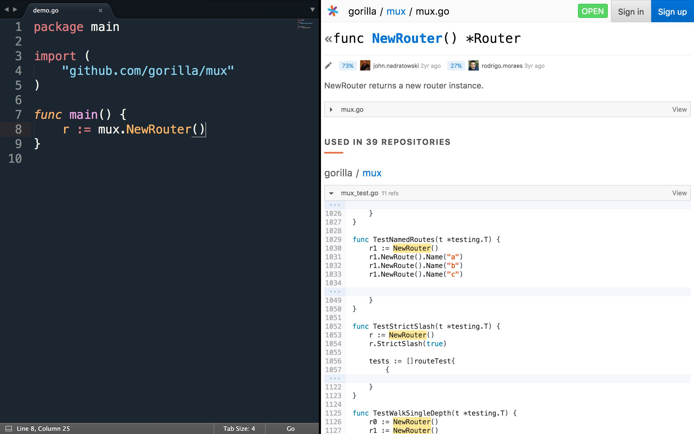

# Sourcegraph Sublime [](https://circleci.com/gh/sourcegraph/sourcegraph-sublime)

## Overview

Sourcegraph Sublime allows you to view Go definitions in real-time on [sourcegraph.com](http://www.sourcegraph.com) as you code, so you can stay focused on what's important: your code. When your cursor is on a certain Go symbol, it should load in a channel in your browser:



## Setup

To install Sourcegraph Sublime, clone `sourcegraph-sublime` into your Sublime Text 3 Packages folder:

OSX:

```shell
git clone https://github.com/sourcegraph/sourcegraph-sublime ~/Library/Application\ Support/Sublime\ Text\ 3/Packages/sourcegraph-sublime
```

Linux:

```shell
git clone https://github.com/sourcegraph/sourcegraph-sublime ~/.config/sublime-text-3/Packages/sourcegraph-sublime
```

## Usage

Sourcegraph Sublime should automatically open a browser tab to initialize your Sourcegraph session when in Go files. If, for any reason, your tab gets closed, press <kbd>&#8984;</kbd>+<kbd>.</kbd>, <kbd>&#8984;</kbd>+<kbd>0</kbd> in any file to reopen the Sourcegraph tab. Alternatively, you can click on `Sublime Text > Preferences > Package Settings > Sourcegraph > Reopen Browser Tab`. As you navigate through Go files, your browser should automatically load the definition and references for recognized symbols.

## Flags

Sourcegraph Sublime has a number of flags to customize your experience. To change your Sourcegraph settings, open `Sourcegraph.sublime-settings` by clicking `Sublime Text > Preferences > Package Settings > Sourcegraph > Settings - User`.

### Custom GOBIN or GOPATH

Sourcegraph Sublime assumes a `GOBIN` of `/usr/local/bin/go`, and loads your `/bin/bash` startup scripts to search for the `GOPATH` environment variable. If your `GOPATH` is not defined in your startup scripts, Sourcegraph Sublime then searches for GoSublime settings files for `GOPATH`. If Sourcegraph cannot find your `GOPATH`, or if you would like to use a custom `GOPATH` or `GOBIN`, add them in the settings file as follows:

```yml
{
	...
	"GOPATH": "/path/to/gopath",
	"GOBIN": "/path/to/gobin",
	...
}
```

### Auto-process selection

Sourcegraph automatically processes your code as you type. If you want to disable this feature, set the `AUTO_PROCESS` flag to `false`. If you disable it, you must press <kbd>&#8984;</kbd>+<kbd>,</kbd>, <kbd>&#8984;</kbd>+<kbd>0</kbd> to process your current selection.

```yml
{
	...
	"AUTO_PROCESS": false,
	...
}
```

### Auto-open browser

This setting auto-opens the channel in your browser when you click on a definition in Go. If it is set to false, then you can access the channel by clicking <kbd>&#8984;</kbd>+<kbd>.</kbd>, <kbd>&#8984;</kbd>+<kbd>0</kbd>. To disable auto-opening, set the `AUTO_OPEN` flag to `false` in your settings:

```yml
{
	...
	"AUTO_OPEN": false,
	...
}
```

### Verbose logging

This setting gives verbose output from Sourcegraph Sublime to the Sublime Text console, which can be helping when troubleshooting Sourcegraph Sublime. To open the Sublime console, simply type <kbd>control</kbd>+<kbd>`</kbd>. Different levels of logging are available:

No logging: 0
Only log symbols identified by godefinfo: 1
Log network calls: 2
Log all debugging information: 3

```yml
{
	...
	"LOG_LEVEL": 1,
	...
}
```

## Godefinfo

Sourcegraph Sublime should automatically install `godefinfo` when it loads your settings. However, if you still receive error message about `godefinfo` installation, you can install it manually by running the following command:

```shell
go get -u github.com/sqs/godefinfo
```

### Local server

If you want to try Sourcegraph Sublime on a local Sourcegraph server, you can define its base URL in this file using the key `SG_BASE_URL`.

```yml
{
	...
	"SG_BASE_URL": "https://www.sourcegraph.com",
	...
}
```

## Support

Sourcegraph Sublime has currently only been tested using Sublime Text 3 on Mac OS X and Linux.
